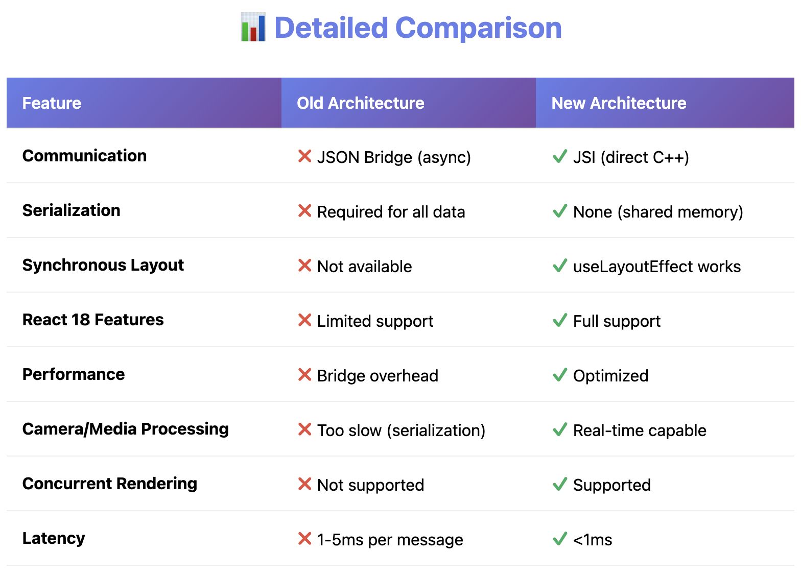

<!-- New Architecture -->

 The new architecture has been available for experimental opt-in RN 0.68 with continued improvements
 in every subsequent release. 
 RN 0.73(December 2023) - new Architecture enabled by default for new projects

1. Synchronous Layout and Effects

function ViewWithTooltip() {
  // ...

  // We get the layout information and pass to ToolTip to position itself
  const onLayout = React.useCallback(event => {
    targetRef.current?.measureInWindow((x, y, width, height) => {
      // This state update is not guaranteed to run in the same commit
      // This results in a visual "jump" as the ToolTip repositions itself
      setTargetRect({x, y, width, height});
    });
  }, []);

  return (
    <>
      <View ref={targetRef} onLayout={onLayout}>
        <Text>Some content that renders a tooltip above</Text>
      </View>
      <Tooltip targetRect={targetRect} />
    </>
  );
}

function ViewWithTooltip() {
  // ...

  useLayoutEffect(() => {
    // The measurement and state update for `targetRect` happens in a single commit
    // allowing ToolTip to position itself without intermediate paints
    targetRef.current?.measureInWindow((x, y, width, height) => {
      setTargetRect({x, y, width, height});
    });
  }, [setTargetRect]);

  return (
    <>
      <View ref={targetRef}>
        <Text>Some content that renders a tooltip above</Text>
      </View>
      <Tooltip targetRect={targetRect} />
    </>
  );
}

With the new architecture, we can use useLayoutEffect to synchronousely
measure and apply layouts update in a single commit, avoid the visual 'jump'

2. Support for Concurrent Renderer & Features(that have shipped in React 18, like Suspense for 
data-fetching, transitions)

3. Fast JS/Native Inferfacing
The new architecture removes the asynchronous bridge between js and native and replaces it with JavaScript Interface(JSI). JSI is an interface that allows JS to hold a reference to a C++ object
and vice-versa. With a memory reference, you can directly invoke methods without serialization costs

