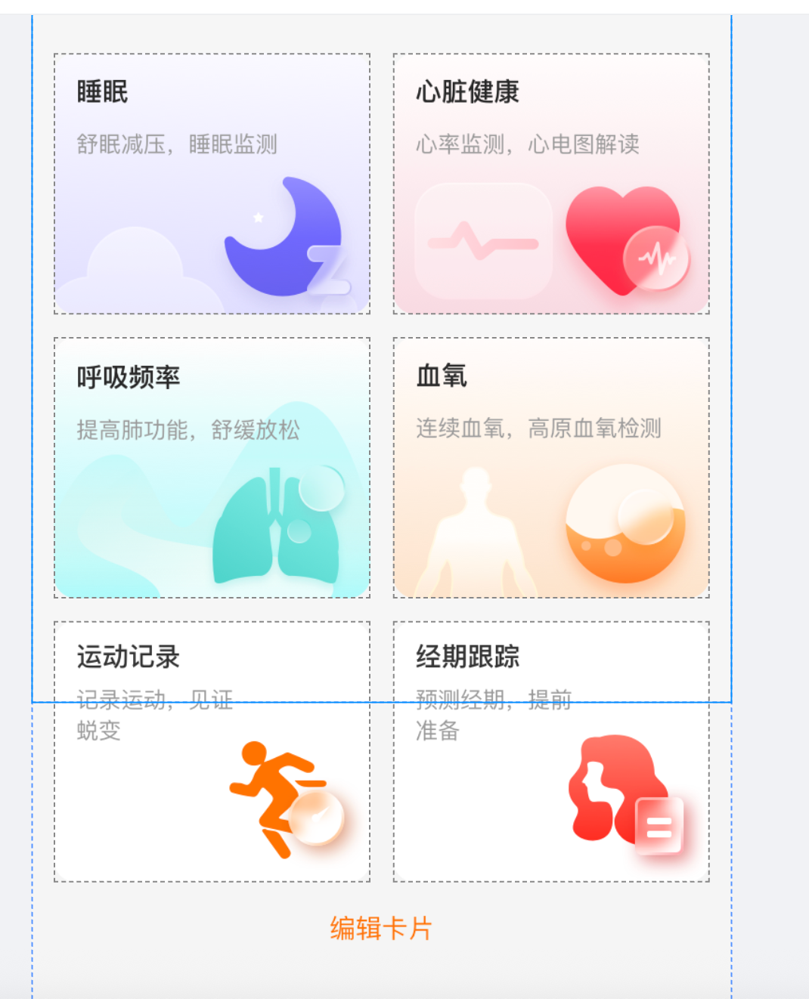
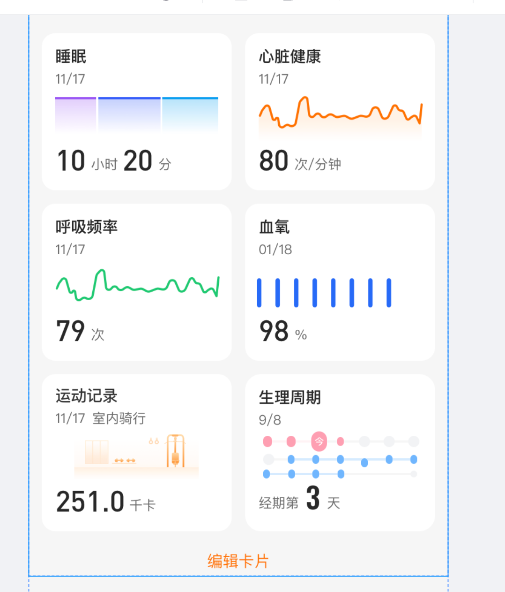

┌─────────────────────────────────────────────────────────────────────────┐
│ index.tsx (410 lines) │
│ Component & Rendering │
└────────────────────────────┬────────────────────────────────────────────┘
│
┌────────────┼────────────┐
│ │ │
┌───────▼──────┐ ┌───▼──────┐ ┌──▼──────────┐
│ useSelector │ │useHealth │ │getConfigured│
│(Redux) │ │DataApi() │ │HealthData()│
└───────┬──────┘ └───┬──────┘ └──┬──────────┘
│ │ │
┌───────────┼────────────┴───────────┴────────────┐
│ │ │
┌───▼────────────▼──────────┐ ┌────────────────────▼────┐
│ health-data-api.ts │ │ health-data-cards.ts │
├──────────────────────────┤ ├─────────────────────────┤
│ Responsibilities: │ │ Responsibilities: │
│ • Device API calls │ │ • Template extraction │
│ • Progressive loading │ │ • Data merging │
│ • State management │ │ • Config handling │
│ • Error handling │ │ • Fallback logic │
└────────┬─────────────────┘ └────────┬────────────────┘
│ │
│ ┌───────────────────┬┘
│ │
┌────▼─────────▼──────────┐
│health-data-transform.ts │
├───────────────────────┤
│ Responsibilities: │
│ • transform\*() │
│ • formatDate() │
│ • formatDuration() │
│ • Data type routing │
└───┬────────────────────┘
│
┌───┴──────────────────────────────────┐
│ Supporting Modules │
├─────────────────────────────────────┤
│ • health-data-definition.ts │
│ • health-data-styles.ts │
│ • health-data-utils.ts │
└─────────────────────────────────────┘

```

## Module Dependency Map

```

index.tsx (Component)
├── depends on: useHealthDataApi()
├── depends on: getConfiguredHealthData()
├── depends on: cardStyles
├── depends on: formatDuration()
├── depends on: findSportBackgroundImageOrNull()
│
├── useHealthDataApi() [health-data-api.ts]
│ └── depends on: Device API (to be implemented)
│ └── depends on: cardTypeMapping
│
├── getConfiguredHealthData() [health-data-cards.ts]
│ ├── depends on: transformBackendDataToFrontend()
│ ├── depends on: cardTypeMapping
│ └── depends on: getCardTemplate()
│
├── transformBackendDataToFrontend() [health-data-transform.ts]
│ ├── depends on: transformHeartRate()
│ ├── depends on: transformRespiratoryRate()
│ ├── depends on: transformBloodOxygen()
│ ├── depends on: transformSleep()
│ ├── depends on: transformSportRecord()
│ ├── depends on: transformPeriodTracking()
│ └── depends on: formatDate()
│
├── cardStyles [health-data-styles.ts]
│ └── depends on: Dimensions (React Native)
│
└── findSportBackgroundImageOrNull() [health-data-utils.ts]
└── depends on: sportImageMapping.json

```

## Data Flow Diagram

```

┌──────────────────┐
│ User sees page │
└────────┬─────────┘
│
▼
┌──────────────────────────┐
│ index.tsx │
│ - Get deviceItem (Redux) │
│ - Call useHealthDataApi()│
└────────┬─────────────────┘
│
▼
┌──────────────────────────────────────┐
│ health-data-api.ts │
│ useHealthDataApi(deviceItem) │
├────────────────────────────────────┤
│ 1. DeviceAPI.getHealthDataCard() │
│ → returns [0,1,2,3,4,5] │
│ │
│ 2. For each card: │
│ DeviceAPI.getHealthDataDetail() │
│ → returns backend data │
│ │
│ 3. Store in backendDataMap │
│ (Triggers re-render) │
└────────┬─────────────────────────────┘
│
┌────▼─────┐
│ values │
│ returned │
│ as each │
│ arrives │
└────┬─────┘
│
▼
┌──────────────────────────────────────┐
│ index.tsx (render) │
│ Call getConfiguredHealthData() │
└────────┬─────────────────────────────┘
│
▼
┌──────────────────────────────────────┐
│ health-data-cards.ts │
│ getConfiguredHealthData() │
├────────────────────────────────────┤
│ 1. Build templates from healthData │
│ 2. Process backend data: │
│ • Transform via health-data- │
│ transform.ts │
│ • Inject into dataByType │
│ 3. Merge templates + data │
│ 4. Return configured cards │
└────────┬─────────────────────────────┘
│
┌────▼──────────┐
│ [ │
│ { type: │
│ 'sleep', │
│ data: {...}│
│ }, │
│ { type: │
│ 'heartRate'│
│ data: {...}│
│ }, │
│ ... │
│ ] │
└────┬──────────┘
│
▼
┌──────────────────────────────────────┐
│ index.tsx (render) │
│ configuredData.map((card) => │
│ renderHealthCard(card)) │
├────────────────────────────────────┤
│ Switch on data type: │
│ • heartRate → renderHeartRateCard() │
│ • sleep → renderSleepCard() │
│ • blood oxygen → renderBloodOxygen()│
│ • respiratory → renderRespiratoryRate│
│ • sport → renderSportRecordCard() │
│ • period → renderPeriodTrackingCard()│
└────────┬─────────────────────────────┘
│
▼
┌──────────────────────────────────────┐
│ UI Rendered │
│ 2-column grid of cards │
│ Cards show either: │
│ • Background + description (no data) │
│ • Charts + values (has data) │
└──────────────────────────────────────┘

````

## Module Interfaces (TypeScript)

### useHealthDataApi()
```typescript
function useHealthDataApi(deviceItem: DeviceItem): {
  backendDataMap: { [key: string]: any };      // Data from APIs
  displayedCards: number[];                     // Which cards to show
  isLoadingData: boolean;                       // Loading state
}
````

### getConfiguredHealthData()

```typescript
function getConfiguredHealthData(
  healthDataList: any[], // Templates
  config: any[], // Config
  backendDataMap?: { [key: string]: any }, // API data
  displayedCards?: number[] // Card numbers
): any[]; // Configured cards
```

### transformBackendDataToFrontend()

```typescript
function transformBackendDataToFrontend(backendData: {
  hasData: boolean | number;
  type: number;
  values?: any[];
  menstrual?: any;
  sport?: any;
}): {
  type: string; // e.g. 'heartRate'
  [dataKey]: any[]; // e.g. 'heartRateData'
  date: string; // MM/DD format
  currentValue: number; // Latest value
  unit: string; // Display unit
} | null;
```

## Benefits of This Architecture

### 1. **Single Responsibility Principle (SRP)**

```
✓ health-data-api.ts       → Only API calls
✓ health-data-transform.ts → Only data transformation
✓ health-data-cards.ts     → Only config & merging
✓ health-data-styles.ts    → Only styles
✓ health-data-utils.ts     → Only utilities
✓ index.tsx               → Only rendering
```

### 2. **Open/Closed Principle (OCP)**

```
✓ Open for extension (add new transformers)
✓ Closed for modification (don't touch other files)

Example: Adding new sport type
  - Edit: health-data-definition.ts (add to sportImagePathMap)
  - That's it! Everything else works
```

### 3. **Dependency Inversion**

```
✓ Components depend on abstractions (hooks, functions)
✓ Not on concrete implementations
✓ Easy to mock for testing

Example test setup:
  jest.mock('./health-data-api', () => ({
    useHealthDataApi: () => mockData
  }));
```

### 4. **DRY (Don't Repeat Yourself)**

```
✓ Transform functions reusable across components
✓ Utilities usable everywhere
✓ Styles defined once, used everywhere
✓ Constants centralized in health-data-definition
```

## File Organization Best Practice

### Each module should:

- ✅ Have ONE clear responsibility
- ✅ Be independently testable
- ✅ Have clear input/output contracts
- ✅ Avoid side effects (except for hooks & components)
- ✅ Be well-documented with JSDoc

### Current implementation follows:

- ✅ Clean separation of concerns
- ✅ Easy to test (functions are pure where possible)
- ✅ Minimal dependencies between modules
- ✅ Clear data flow from top to bottom
- ✅ Comprehensive logging for debugging

## Comparison Matrix

| Aspect                   | Before                   | After                     |
| ------------------------ | ------------------------ | ------------------------- |
| **File Size**            | 43KB                     | 13KB main + 6 modules     |
| **Main Component Lines** | 1100+                    | 410                       |
| **Modules**              | 1 monolithic             | 6 focused                 |
| **Testability**          | Low (mixed concerns)     | High (isolated functions) |
| **Reusability**          | Low (coupled)            | High (decoupled)          |
| **Maintainability**      | Hard                     | Easy                      |
| **Scalability**          | Poor (add to monolith)   | Good (add new modules)    |
| **Code Duplication**     | Some                     | None                      |
| **Debug clarity**        | Confusing (which layer?) | Clear (exact module)      |

---

**Result**: Clean, maintainable, scalable architecture that's easy to understand and modify!
